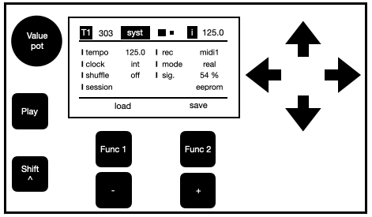

# ACIDUINO V2 User Manual

## Introduction

Up to 16 Tracks TB303/TR808 sequencer with step, pattern and mute automation grid system, MIDI Controller, OLED display and extensible modular design to plug more potentiometers, buttons, MIDI or CV/Gate interfaces.

a friend of mine some time ago had come out with this one:
"Put your DIY super powers to the test building your own Roland’s TB-303 and TB-808 step sequencer! An Arduino based clone project specially hacked with corrosive features for live performances! Save your money building this classic sequencer clone faster than a blink of an eye."

## BEFORE GETTING STARTED

To use aciduino, follow these steps:

1. Read the documentation [here](https://github.com/midilab/aciduino/tree/master/v2/)
2. Build your device [following these steps](https://github.com/midilab/aciduino/tree/master/v2#assembly)
3. Download the latest [software](https://github.com/midilab/aciduino/releases)
4. Check your hardware configuration in `/AciduinoV2/0_hardware_setup.ino`
5. Ajust the sequencer to your taste in `/AciduinoV2/src/sequencer/setup.h`

## USER INTERFACE
If you followed the assembly guide you should have a device like this :

The GUI is divided into the following main sections:

- **Header bar:** Contains the Track number (by default T1 to T5) and type (303 or 808), the Page name and selected subpage (1 or 2), the clock soucre and tempo value (40-180).
- **Subpage display:** where the actual tweaking occurs.
- **Function buttons label:** Provides a clear feedback for the 2 function buttons

## WORKFLOW

The interface presents you simple schema to navigate and interact with you aciduino.

**Navigation buttons:** UP, DOWN, LEFT. RIGTH. use to navigate thru page elements.  
*4 right most buttons*  

**Function buttons:** If the current selected element has an action, it will show up at bottom of your display with the action name for each button.  
*2 upper buttons*  

**Generic buttons:** Acts as value changer, a decrementer and incrementer for almost all elements.  
*2 lower buttons*  

**Pot:** Acts as a value changer just like generic buttons, most of elements can be changed using generic buttons or the pot as wish.  

**Shift button** Hold it while press another interface button.  
*bottom left button* 

**Transport button** press to start or stop the sequencer  
*middle left button* 
 

**Shift + Nav UP/DOWN:** Change page  
**Shift + Nav LEFT/RIGHT:** Changes subpage  
**Shift + Generic button 1:** Previous track  
**Shift + Generic button 2:** Next track  

 ### **System Page** 

 
**Tempo** set uClock tempo from 40 to 180  
*pot=change value, F1=rec F2=play, generic buttons=NA* 
 
**clock:** choose clock source, internal, midi1 or midi2
  **shuffle:** turn the groove on or off
  **sig.:** set the swing signature (3 MPC signatures, user signatures can be added)
  **rec:** input source midi1 or midi2 
  **mode:** record in real time or stepmode
  **session:** save your ideas on eeprom or SDCard

 ### Sequencer page 
 
 

 **Step Sequencer Pot, Shift + Pot**  
303: [Pot] Changes notes [Shift + Pot] Changes octave   
808: [Pot] Changes voice [Shift + Pot] Changes voice config(midi cc or cv port)  

 - **Selected item:** <table>
  <tr>
    <th>Common</th>
    <th>303</th>
    <th>808</th>
  </tr>
  </tr>
     <td> **length:**  </td>
     <td> 0 to whatever you defined in `/AciduinoV2/src/sequencer/setup.h` </td>
     <td> 0 to 64 for a 808 track. Note that each voice of a 808 track can have a different sequence length </td>
  </tr>
  <tr>
    <th> </th>
    <td>**Voice:** set the tonic note</td>
    <td>**Note:** set the drum part midi note number</td>
  </tr>
  <tr>
    <td>**Shift :** offset the whole sequence forward or backward</td>
    <td> </td>
    <td> </td>
  </tr>
   <tr>
    <td> </td>
    <td>**transpose :** transpose the tonic note</td>
    <td>**roll:** set the roll type</td>
  </tr>
  <tr>
  <td> **Fill:** </td>
  <td> </td>
  <td></td>
  </tr>
</table>

 ### Generator page 
 
 
 

 - **Header bar:** 

 ### Pattern page ptrn
 
  

 - **Header bar:** Contains
 ### MIDI page midi
 

 - **Midi CCs** they are sent on the selected Track MIDI channel, CC# and naming can be changed in in `/AciduinoV2/page_midi.ino` : look for     "midiControllerComponent.set303Control("filter", 74);"

 

## Cheatsheet

## Support

Check the [official midilab website](https://midilab.co/)  for the latest news

For any inquiries or technical support, please open an [issue](https://github.com/midilab/aciduino/issues)

For some nice talking, ideas or questions you can say hi on our  [discord channel](https://discord.com/channels/1137685010967703582/1137685011416498236)

---
 2023 Aciduino. 